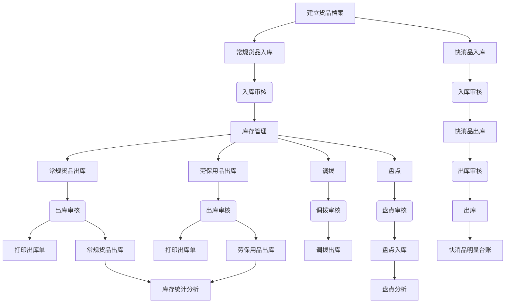

```mermaid
graph TD
A[建立货品档案] --> B1[常规货品入库]
B1 --> C1(入库审核)
C1 --> D1[库存管理]
D1 --> E1[常规货品出库]
D1 --> E2[劳保用品出库]
D1 --> E3[调拨]
D1 --> E4[盘点]
E1 --> F1(出库审核)
E2 --> F2(出库审核)
E3 --> F3(调拨审核)
E4 --> F4(盘点审核)
F1 --> G1[打印出库单]
F1 --> H1[常规货品出库]
F2 --> G2[打印出库单]
F2 --> H2[劳保用品出库]
H1 --> I1[库存统计分析]
H2 --> I1
F3 --> G3[调拨出库]
F4 --> G4[盘点入库]
G4 --> H4[盘点分析]

A --> B2[快消品入库]
B2 --> C2(入库审核)
C2 --> D2[快消品出库]
D2 --> E5(出库审核)
E5 --> F5[出库]
F5 --> G5[快消品明显台账]
```
